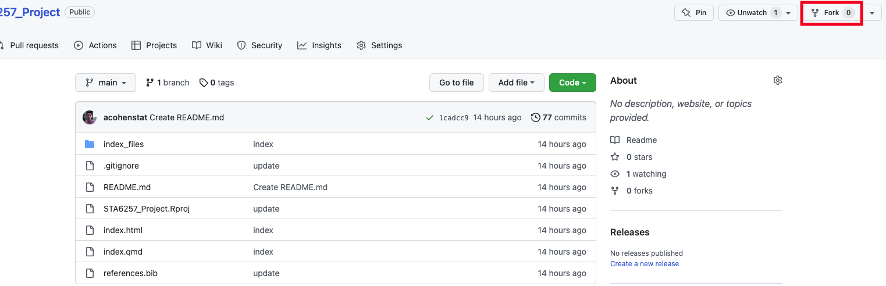

# STA6257_Project

Create a GitHub page for the project

## GitHub:
#### 1. Create a GitHub account and Sign in
#### 2. Go to https://github.com/acohenstat/STA6257_Project and fork (create a copy to your GitHub)

#### 3. Change the name of the repo to *STA6257_Project_NameofGroup*
#### 4. Go to *Settings* -> *Pages* -> under *Branch* -> select *main*
#### 5. Wait for a few seconds and refresh the page. You see the link of the page. 

## RStudio:
#### 1. Go to RStudio
#### 2. Create a Version Control Project and Clone the repo. 

More information:
- [GitHub](https://happygitwithr.com/index.html)
- [Video RStudio connection to GitHub](https://www.youtube.com/watch?v=MdmnE3AnkQE)
